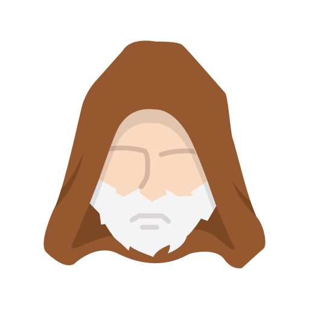

<p align="center">
   
</p>

<h3 align="center">Personal-Webpage</h3>

<p align="center"> 
      In this project, I tried to showcase my achievements in a pleasant way building a personal webpage from scratch and learn something in the process 
    <br> 
</p>

## 📝 Table of Contents
- [About](#about)
- [Getting Started](#getting_started)
- [Deployment](#deployment)
- [Usage](#usage)
- [Built Using](#built_using)
- [Authors](#authors)
- [Acknowledgments](#acknowledgement)

## 🧐 About <a name = "about"></a>
This website is a digital version of my traditional paper resume. It shows my education, skills,  previous positions and projects I've worked on. But, it also shows things I cannot accurately share using a paper resume(such as links to my projects)

## 🏁 Getting Started <a name = "getting_started"></a>
These instructions will get you a copy of the project up and running on your local machine for development and testing purposes. See [deployment](#deployment) for notes on how to deploy the project on a live system.

### Prerequisites
What things you need to install the software and how to install them.

```
Give examples
```

<!--### Installing
A step by step series of examples that tell you how to get a development env running.

Say what the step will be

```
Give the example
```

And repeat

```
until finished
```

End with an example of getting some data out of the system or using it for a little demo.

## 🔧 Running the tests <a name = "tests"></a>
Explain how to run the automated tests for this system.

### Break down into end to end tests
Explain what these tests test and why

```
Give an example
```

### And coding style tests
Explain what these tests test and why

```
Give an example
```

## 🎈 Usage <a name="usage"></a>
Add notes about how to use the system.

## 🚀 Deployment <a name = "deployment"></a>
Add additional notes about how to deploy this on a live system.-->

## ⛏️ Built Using <a name = "built_using"></a>
- [Visual Studio Code](https://code.visualstudio.com/) - code editor
- [NodeJs](https://nodejs.org/en/) - Server Environment

## ✍️ Authors <a name = "authors"></a>
- [@RusuGabriel](https://github.com/RusuGabriel) - Idea & Implementation

## 🎉 Acknowledgements <a name = "acknowledgement"></a>
- Hat tip to anyone whose code was used
- Inspiration
- References
